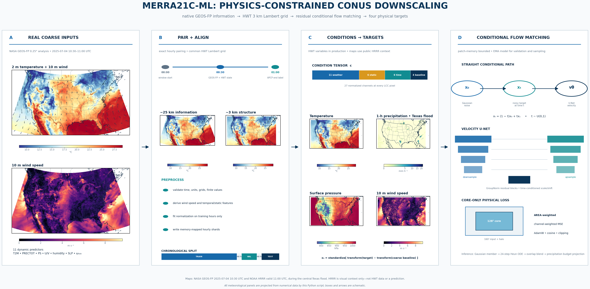

# MERRA21C-ML

Patch-based conditional flow matching for **native GEOS-FP (~25 km) → HWT ~3 km LCC** downscaling over CONUS. Coarse predictors already interpolated to 3 km are still coarse information. This package uses the existing regridding products and the archive paths in [data.md](data.md).

Targets: **2 m temperature, precipitation rate, surface pressure, and 10 m wind speed**, sampled hourly at matched :30 timestamps. Conditions include coarse weather, topography, latitude/longitude, cell area, annual phase, UTC hour, and local solar hour. Training and inference operate on patches in GPU memory; full fields are processed one timestamp at a time in host memory.

This is an implemented and CPU smoke-tested starting configuration, **not a trained model or an empirically established best configuration**. NASA archive validation, A100 peak memory, distributed execution, and real-data skill must be measured on Discover. See [design and scientific assumptions](docs/method.md) and [validation record](docs/validation.md).

## Workflow overview



The checked-in image predates the PRECTOT correction: its APCP timeline label is obsolete. The updated figure script uses same-time HWT PRECTOT; regenerate from the corrected archive below.

Every map above is projected from numerical meteorological fields by `scripts/make_workflow_figure.py`; the diagram is not an AI-generated image. The checked-in version uses a fixed real-weather case: [NASA GEOS-FP](https://gmao.gsfc.nasa.gov/geos-system-news/ftp-access-to-geos-fp-data-ends-on-march-20-2019/) at 10:30 UTC and [NOAA HRRR](https://registry.opendata.aws/noaa-hrrr-pds/) valid at 11:00 UTC on 4 July 2025, during the [central-Texas heavy-rain and flash-flood event](https://www.wpc.ncep.noaa.gov/metwatch/metwatch_mpd_multi.php?md=585&yr=2025). State, national, and coastline geometry is drawn on a common Lambert conformal projection.

HRRR is used only as public high-resolution visual context because the HWT target archive is not public; it is **not presented as HWT training data or as a model prediction**. Generate the public version (downloads only the required HRRR messages and caches all source files under ignored `data/`):

```bash
python -m pip install -e '.[workflow]'
python scripts/make_workflow_figure.py
```

To replace the public context with exact project maps after a Discover preparation run:

```bash
python scripts/make_workflow_figure.py \
  --archive data/paired_hourly_prectot \
  --predictions runs/cfm128_prectot/predictions \
  --run-dir runs/cfm128_prectot \
  --timestamp 20251018_0030 \
  --output docs/assets/merraflow-workflow.png
```

Omit `--timestamp` to use the first prepared hour. In archive mode the map panels come directly from the GEOS-FP baselines and HWT targets stored by the implemented pipeline.

## Training method

The model learns a **standardized residual** rather than the full high-resolution field. For each target, the preprocessor transforms the constrained HR target and the coarse baseline, subtracts them, then fits train-only residual statistics. At training time it draws an independent Gaussian field `x0`, selects a flow time `t` uniformly from 0 to 1, and constructs the straight path `xt = (1 - t) x0 + t x1`. The conditional U-Net predicts the path velocity `x1 - x0` from `xt`, `t`, and the spatial conditions.

The objective is a channel-weighted, AREA-weighted squared velocity error. Halo pixels provide context but are excluded from the loss; this is why the 128-pixel preset sends a 160×160 patch through the network and scores only its 128×128 core. The U-Net uses residual GroupNorm blocks, time-conditioned scale/shift, nearest-neighbor upsampling, and optional activation checkpointing. It deliberately has no global attention or optimal-transport coupling, so it remains patch-memory bounded.

Each epoch samples deterministic random timestamp/crop pairs from the training split; no crop is assigned to a different time split. The optimizer is AdamW with linear warmup followed by cosine decay, gradient accumulation and clipping. An exponential moving average (EMA) of the model is evaluated on a fixed validation patch set and is the model used for `best.pt` and sampling. DDP partitions the same deterministic epoch sample set across ranks.

## Install

Use the existing Discover environment, with a CUDA-enabled PyTorch build appropriate to the node:

```bash
conda activate /gpfsm/dnb10/projects/p311/ML_downscaling/env
python -m pip install -e '.[test]'
python -c 'import torch; print(torch.__version__, torch.cuda.is_available(), torch.cuda.get_device_name(0))'
mkdir -p logs
```

`environment.yml` retains the dependencies for the existing xESMF regridding scripts. The new flow-matching implementation uses PyTorch directly and does not require Lightning or torchcfm. `python -m merraflow.cli --help` works after installing the package.

## Complete local software test

```bash
bash scripts/test_pipeline.sh
```

This runs numerical/integration tests and creates a small synthetic NetCDF archive, fits a tiny CPU model, resumes checkpoints in the tests, generates three members, computes verification metrics, and writes diagnostic PNGs. Synthetic results validate software behavior, not atmospheric skill. The script creates a new directory under `runs/` by default; an optional first argument selects it.

## Prepare real data

1. Generate the bilinear LCC conditioning files with the existing `scripts/regrid_lowres.py` or `scripts/slurm_regrid_year2025.sh`.
2. Review dates and paths in `configs/discover.yaml`. It starts with 2025, train January–August, validation September–mid-October, and test late October–December, with 48-hour split gaps. **Set these to the hours actually present.** This single-year split does not establish all-season generalization.
3. Confirm that `hwt_30mn_slv_LCC` contains `PRECTOT` in kg m-2 s-1 at each requested :30 timestamp. The pipeline uses the same matched HR surface file and `PRECTOT × 3600` conversion as `scripts/plot_diagnostics.py`. All HR targets use the :30 snapshot, approximating the LR hourly mean; this is not an exact averaging-window match. Accumulated `APCP` files are not used or required, and there is no fallback to them.
4. Prepare the archive:

```bash
python -m merraflow.cli prepare --config configs/discover.yaml
# On Discover, submit 12 monthly tasks (maximum 10 concurrent) and a dependent finalizer:
bash scripts/submit_prepare_flow.sh
```

The monthly submission is restart-safe. Each task checks all five float32 arrays and their expected dimensions before skipping an existing timestamp, so completed shards from an interrupted serial or array run are retained. The finalizer runs only after all 12 tasks succeed, merges train-only normalization moments, validates every shard and monthly manifest, and writes `index.json` last. Cancel any still-running serial preparation job before launching the array so two writers cannot work on the same timestamp. Set `PREP_YEAR` to override the default 2025 year; the current Discover configuration covers one calendar year.

The preprocessor checks time coordinates, units, shapes, finite values and HR/native grid consistency. It derives wind speed from U/V, converts native and HR precipitation rates to mm/hour, and interprets topography using its units. Unknown units fail rather than being guessed. The existing `data_audit.py` prints/extracts basic surface geometry.

**Migration from APCP targets:** use the new default `data/paired_hourly_prectot` archive and `runs/cfm128_prectot` training directory. Rerun monthly preparation and finalization, then start fresh training (no old checkpoint resume). Preparation format 3 rejects legacy shards and archives, including completed monthly runs. Existing low-resolution regridding products can be reused; old targets, residuals, normalization statistics and checkpoints cannot. Old directories are preserved, so allow space for the new archive. `truth.npy` now contains the matched diagnostic HR rate; the existing optional training-budget projection still produces `target.npy` separately.

Missing hours are written to `data/paired_hourly_prectot/missing.json`; the default fails if any requested pairs are incomplete. Narrow the configured date ranges, or explicitly set `strict_missing: false` to use only complete hours and retain the missing-hour audit. No nearest-time pairing or random train/test patch splitting occurs.

Before writing shards, preparation scans every regridded file for the configured predictor schema and writes problems to `data/paired_hourly_prectot/predictor_gaps.json`. The regridder uses the same required-variable set when deciding whether an existing output may be skipped, so rerunning the regrid job repairs legacy partial files instead of treating them as complete. A source file that genuinely lacks a required predictor fails with its exact path; do not fill or drop a predictor for only part of the record.

Outputs include a timestamp/split manifest, original HR truth, constrained HR targets, coarse baselines, transformed residuals, condition arrays, train-only normalization statistics, grid metadata, and a precipitation adjustment audit. Each timestamp is a set of memory-mappable `.npy` files; patches are sampled on demand without duplicating overlapping crops. The minimal pipeline uses four dynamic predictors (`PRECTOT`, `U10M`, `V10M`, and `TQV`) plus six static, six temporal, and four baseline channels. At 1059×1799, the resulting 20 stored float32 planes use about **152 MB/hour, or 1.32 TB for the configured 8,664 hours**, excluding original/regridded data. Place `data.prepared` on Discover scratch with sufficient capacity. The loader requires complete finite fields; masked ocean/land-only training is not implemented.

Preparation can rebuild incomplete shards after interruption if no completed `index.json` exists. A preparation signature prevents monthly tasks from mixing different data configurations. Once preparation completes, use a new output directory when inputs/configuration change. It never silently reuses statistics from a different run.

## Train on A100

```bash
python -m merraflow.cli train --config configs/discover.yaml
# Single node, two A100 GPUs when two were allocated:
torchrun --standalone --nproc-per-node=2 -m merraflow.cli train --config configs/discover.yaml
# Queue-friendly default: request one Discover A100:
sbatch scripts/slurm_train_flow.sh
# Request two A100s when shorter runtime is worth a potentially longer queue:
sbatch --gres=gpu:2 scripts/slurm_train_flow.sh
```

| Setting | Conservative A100 start | Larger A100 80 GB candidate |
|---|---:|---:|
| Config | `configs/discover.yaml` | `configs/a100_80gb.yaml` |
| Scored core | 128×128 | 256×256 |
| Context halo each side | 16 | 32 |
| Network input | 160×160 | 320×320 |
| Base channels | 48 | 64 |
| Batch per GPU | 2 | 2 |
| Accumulation | 8 | 8 |
| Effective batch / GPU | 16 | 16 |
| Default GPU count | 1 | 1 |
| Default effective global batch | 16 | 16 |
| Two-GPU effective global batch | 32 | 32 |
| Precision | BF16 | BF16 |
| Activation checkpointing | Enabled | Enabled |

Run the memory benchmark inside an A100 allocation before choosing a batch size:

```bash
python scripts/benchmark_a100.py --config configs/discover.yaml --batches 1,2,4
```

It includes activations, gradients, AdamW state and EMA, and records out-of-memory cases. It uses synthetic patches, so real I/O throughput and validation skill need separate measurement.

Both use AdamW at 2e-4, warmup then cosine decay, gradient clipping, EMA, and an area-weighted velocity loss on the patch core. Full-domain fields never enter GPU memory. Epoch logs include allocated peak GPU memory. Benchmark the first epoch, then change batch/patch size if appropriate; neither preset has an A100 memory guarantee yet. The default one-GPU job has an effective global batch of 16; a two-GPU override raises it to 32. Slurm cannot request a range of GPU counts, but the launcher dynamically uses every GPU in the allocation. Resume requires the same GPU/world count as the original run. The Discover template uses the verified `s3292` account, `alla100` QoS, `gpu_a100` partition, and Rome constraint.

```bash
python -m merraflow.cli train --config configs/discover.yaml --resume runs/cfm128_prectot/last.pt
# scheduler resume:
RESUME=runs/cfm128_prectot/last.pt sbatch scripts/slurm_train_flow.sh
```

Each training directory contains `config.json`, `stats.json`, append-only `history.jsonl`, `last.pt`, and (when validation improves) `best.pt`. It also writes a durable completed-epoch recovery point every `train.checkpoint_interval` epochs (five by default), e.g. `epoch_0005.pt`. A checkpoint contains the model and EMA weights, optimizer, scheduler, scaler, per-rank Torch RNG states, resolved configuration, statistics, and prepared-archive fingerprint. `best.pt` is selected by fixed EMA validation flow loss. Exact resume is at epoch boundaries with the same dataset, model, patch, training settings and number of ranks. Resume does not support changing the epoch schedule; start a distinct experiment for that. Training never uses the test split.

### Three-case, five-member best-model diagnostic

After training finishes, generate five full-resolution members for three held-out test timestamps. The first column is the original discrete GEOS-FP ~25 km field on its native latitude/longitude grid—not the bilinearly interpolated LCC baseline. The other columns are original HWT, one individual member, five-member ensemble mean, and ensemble-mean-minus-HWT. RMSE remains a fair same-grid comparison: it uses the interpolated LCC baseline, which is explicitly labelled in the plot. It writes both a full-domain map and an event-centered precipitation zoom using `imshow(..., interpolation='nearest')`, plus ensemble-mean area-weighted RMSE comparisons, training history, NetCDF samples, and machine-readable metrics:

```bash
python scripts/test_best_model.py --config configs/discover.yaml --checkpoint runs/cfm128_prectot/best.pt
# Discover GPU job; replace the dependency with the training job ID:
sbatch --dependency=afterok:<TRAIN_JOB_ID> scripts/slurm_test_best_model.sh
```

The default creates 15 generated fields (five members for each of three timestamps) under `runs/cfm128_prectot/test_best_model_m5`. Its first case is selected from held-out data using a reproducible high-wind, low-sea-level-pressure signature; it is labelled *storm-like selected case*, not asserted to be a hurricane or named event. The remaining cases are seeded random held-out timestamps. Set `MEMBERS` to override the ensemble size (minimum two), `SAMPLES` to change the number of cases, `--sample-seed` to change the non-storm choices, or pass explicit held-out IDs with `--timestamps`. The summary compares the interpolated LCC baseline against the ensemble mean; individual-member RMSE is retained separately. Each invocation regenerates its requested NetCDF members and removes stale members for those timestamps in its own diagnostic `predictions/` directory, so an existing diagnostic output is refreshed rather than reused.

### Historical APCP diagnostic

The old model can be inspected with the same five-member, full-domain/zoom diagnostic, but it remains a **historical debugging result** because its targets use the invalid APCP pairing. It cannot be used for training, checkpoint selection, or comparison with the corrected PRECTOT run:

```bash
sbatch scripts/slurm_test_best_model_legacy_apcp.sh
```

This explicitly reads `configs/discover_legacy_apcp.yaml`, `data/paired_hourly`, and `runs/cfm128/best.pt`, then writes to `runs/cfm128/test_best_model_m5_legacy_apcp`. Its figures and metrics carry `target_definition: legacy_apcp`.

## Generate, evaluate and plot

Start with a few validation hours to measure cost and ODE convergence:

```bash
python -m merraflow.cli predict --config configs/discover.yaml --checkpoint runs/cfm128_prectot/best.pt --split val --limit 4
python -m merraflow.cli evaluate --config configs/discover.yaml --split val
python -m merraflow.cli plot --config configs/discover.yaml
```

After selecting settings on validation, use a fresh `inference.output` for held-out test predictions:

```bash
python -m merraflow.cli predict --config configs/discover.yaml --checkpoint runs/cfm128_prectot/best.pt --split test
python -m merraflow.cli evaluate --config configs/discover.yaml --split test
python -m merraflow.cli plot --config configs/discover.yaml --timestamp 20251018_0030
```

The default general inference configuration is 8 members, 24 Heun steps (48 network evaluations per tile), stride 96, and one tile/member at a time on the GPU; the focused test script above overrides this to five members. Overlaps share the member's initial full-field noise and use positive tapered weights. Conservation is applied after blending in transformed space and decoding to physical units. Each timestamp/member gets one compressed NetCDF with coordinates, LR conditioning-window bounds, point-time HR target semantics, units, source grid mapping when available, seed, checkpoint SHA-256, configuration provenance, and mass-check results. Existing files are not overwritten. Use a new directory for a new model or sampler configuration.

Evaluation writes `evaluation/summary.json` and `per_hour.json` with area-weighted RMSE/MAE/bias/correlation, empirical CRPS, ensemble spread, interval coverage, precipitation CSI/POD/FAR/Brier scores, FSS, reliability bins, ranks, tail quantiles, and per-member mass errors. The summary is explicitly a mean of hourly scores, not a pooled RMSE. Unpredicted held-out hours are listed so a `--limit` run cannot masquerade as full-test coverage. Single-member probabilistic scores are degenerate; final verification needs ensembles.

Plots include fields, ensemble spread, radial spectra, rank histograms, precipitation tails, conservation adjustments, training curves, FSS and reliability. They use native LCC pixel axes; no unverified projection is invented. Run evaluation first to include skill curves. `plot` shows the first predicted timestamp unless `--timestamp` is supplied.

## Inference without HR labels

Copy the training config, keep its preprocessing/model conventions, set new LR/native dates/paths, choose a **new** `data.prepared`, and a new `inference.output`:

```bash
python -m merraflow.cli prepare-predict --config configs/future.yaml --reference-archive data/paired_hourly_prectot
python -m merraflow.cli predict --config configs/future.yaml --checkpoint runs/cfm128_prectot/best.pt --split predict
```

`prepare-predict` needs only regridded predictors and native precipitation. It reuses the original static grid and train-only statistics, and does not read HR labels. New inputs must be regridded using the same HWT grid; legacy regridded files lack geographic coordinates, so only their shape can be checked automatically.

## Precipitation contract

Precipitation is represented as `log1p(r / 1 mm/hour)` during learning and decoded to nonnegative mm/hour. Speed uses `log1p(speed / 5 m/s)`. Temperature and pressure use linear residuals. Normalization is fitted on training data only.

For each native-cell footprint `g`, the final member satisfies:

```text
sum(AREA[i] * generated_precip[i], i in g)
  = native_precip[g] * sum(AREA[i], i in g)
```

Footprints assign each HR pixel to the native cell containing its center. Domain-edge cells use only represented LCC area. This is exact to float32 tolerance **for that discrete footprint definition**; it is not polygon-overlap conservative remapping. Dry native cells stay dry. A wet-budget cell with an all-dry proposal falls back to the native precipitation template. A 0.01 mm/hour threshold is applied before projection; final conservation may move amounts below that threshold again. Check `precip_audit.json` and the exported `precip_unconstrained` field to quantify how restrictive the budget is.

The default also projects training precipitation to this budget, retaining the original HR truth separately. This avoids asking a model to learn targets incompatible with its enforced budget. Evaluation reports both references. It does not claim the source rain totals are more accurate than HR totals, and strict conservation cannot correct a dry or biased source budget.
